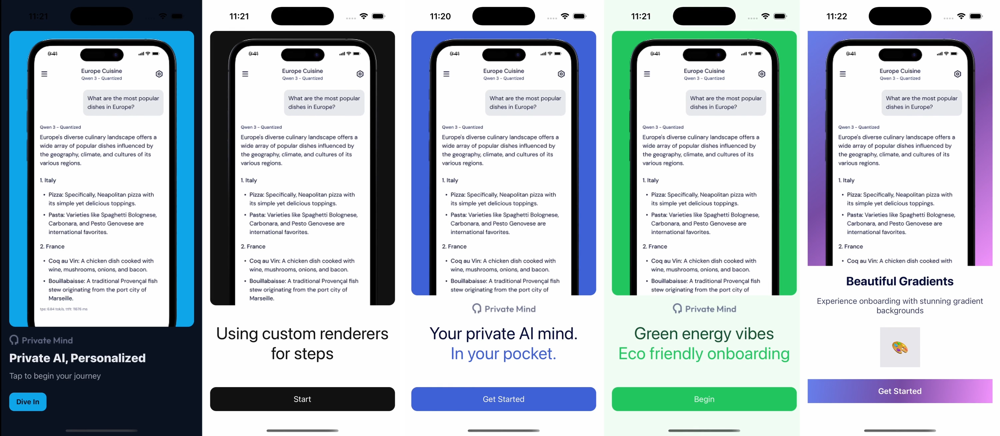
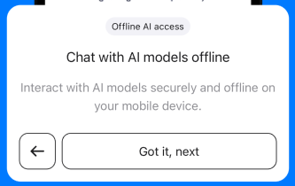
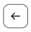
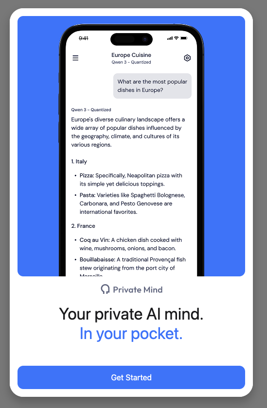
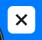

https://github.com/user-attachments/assets/bb51a0c3-15be-42b6-b20d-c33c29b84bc7

<!--  -->

# react-native-onboarding

✨ **Beautiful, customizable onboarding/tutorial flows** for React Native — with smooth animations, flexible theming, and highly customizable components.

## 🚀 Features

* **Cross-platform** – Works seamlessly on iOS, Android, and Web
* **Smooth animations** – React Native Reanimated for smooth transitions
* **Works out of the box** – Just install and use with default styles
* **Flexible theming and custom components** – Complete control over colors, fonts, and styling

## Inspired by [Private Mind App](https://github.com/software-mansion-labs/private-mind)

A private AI app that runs entirely offline on your device, with no data sent to the cloud and no internet connection required. Private Mind represents a new era of AI—powerful, personal, and completely private.


## 📦 Installation

```sh
npm install @blazejkustra/react-native-onboarding
```

The library requires these dependencies for animations and safe area context:

```sh
npm install react-native-reanimated react-native-safe-area-context
```

Optionally for image support, install one of:
```sh
npm install expo-image
```

```sh 
npm install react-native-svg
```

## 🛠 Basic usage

You can use Onboarding component with default styles just by passing required props to the component:

```tsx
import Onboarding from 'react-native-onboarding';

function MyOnboarding() {
  return (
    <Onboarding
      introPanel={{
        title: 'Welcome to My App',
        subtitle: 'Let\'s get you started',
        button: 'Get Started',
        image: require('./assets/logo.png'),
      }}
      steps={[
        {
          title: 'Step 1',
          description: 'This is the first step of your journey',
          buttonLabel: 'Next',
          image: require('./assets/step1.png'),
          position: 'top',
        },
        {
          title: 'Step 2', 
          description: 'Learn about our amazing features',
          buttonLabel: 'Continue',
          image: require('./assets/step2.png'),
          position: 'bottom',
        },
      ]}
      onComplete={() => {
        await AsyncStorage.setItem(ONBOARDING_COMPLETED_KEY, 'true');
        console.log('Onboarding completed!')
      }}
      onSkip={() => console.log('Onboarding skipped')}
      onStepChange={(step) => console.log('Current step:', step)}
    />
  );
}
```

### Custom Components

Or you can create your own custom components for the intro panel, individual steps, background, close button, etc.

```tsx
function CustomIntro({ onPressStart }: { onPressStart: () => void }) {
  return (
    ... your custom intro panel ...
  );
}

function CustomStep({ onNext, onBack, isLast }: { onNext: () => void, onBack: () => void, isLast: boolean }) {
  return (
    ... your custom step component ...
  );
}

function CustomBackground() {
  return (
    ... your custom background component ...
  );
}

function CustomCloseButton({ onPress }: { onPress: () => void }) {
  return (
    ... your custom close button component ...
  );
}

<Onboarding
  introPanel={CustomIntro}
  background={CustomBackground}
  skipButton={CustomCloseButton}
  steps={[
    {
      component: CustomStep,
      image: require('./assets/step1.png'),
      position: 'top',
    },
    // ... more steps
  ]}
  // ... other props
/>
```

## 📖 API

To see all the props and their types, check the [types](src/spill-onboarding/types.ts) file. Also example usages are available in the [example](example/src/screens) catalog.

### OnboardingProps

#### `introPanel`
**Type:** `OnboardingIntroPanel`  
**Required** - The welcome screen that users see at the start of the onboarding

The intro panel can be either:
- **Default panel**: Pass an object with `title`, `subtitle`, `button`, `image`
- **Custom component**: Pass a render function that receives `onPressStart` callback

```tsx
// Default intro panel
introPanel={{
  title: "Welcome to MyApp",
  subtitle: "Let's get you started",
  button: "Get Started",
  image: require('./assets/welcome.png')
}}

// Custom intro panel
introPanel={({ onPressStart }) => (
  <CustomWelcomeScreen onStart={onPressStart} />
)}
```


#### `steps`
**Type:** `OnboardingStep[]`  
**Required** - Array of onboarding steps to display
  


Each step can be either a default text-based step or a fully custom component:

```tsx
// Default step
{
  label: "Step 1",
  title: "Connect Your Account",
  description: "Link your account to get started",
  buttonLabel: "Connect",
  image: require('./assets/step1.png'),
  position: 'top'
}

// Custom step component
{
  component: ({ onNext, onBack, isLast }) => (
    <CustomStepComponent 
      onNext={onNext} 
      onBack={onBack} 
      isLast={isLast} 
      ... other props ...
    />
  ),
  image: require('./assets/step2.png'),
  position: 'bottom'
}
```


#### `onComplete`
**Type:** `() => void`  
**Required** - Callback fired when user completes the final step, usually used to save the completion state to the local storage and navigate to the main app.

```tsx
onComplete={() => {
  // Navigate to main app
  navigation.navigate('Home');
  // Or save completion state
  AsyncStorage.setItem('onboarding_completed', 'true');
}}
```

#### `onSkip`
**Type:** `() => void`  
**Optional** - Callback fired when user skips onboarding, usually used to track the skip event and navigate away from the onboarding.

```tsx
onSkip={() => {
  // Track skip event
  analytics.track('onboarding_skipped');
  // Navigate away
  navigation.goBack();
}}
```

#### `onStepChange`
**Type:** `(stepIndex: number) => void`  
**Default:** `undefined` - Callback fired when the active step changes

```tsx
onStepChange={(stepIndex) => {
  // Track progress
  analytics.track('onboarding_step', { step: stepIndex });
}}
```

#### `showCloseButton`
**Type:** `boolean`  
**Default:** `true` - Whether to show the close button in the header

```tsx
showCloseButton={false} // Hide close button
```

#### `showBackButton`
**Type:** `boolean`  
**Default:** `true` - Whether to show back button on steps (except first step)



```tsx
showBackButton={false} // Disable back navigation
```

#### `wrapInModalOnWeb`
**Type:** `boolean`  
**Default:** `true` - Whether to wrap the onboarding in a modal on web



```tsx
wrapInModalOnWeb={false} // Disable modal wrapping
```

#### `animationDuration`
**Type:** `number`  
**Default:** `500` - Animation duration in milliseconds for step transitions

```tsx
animationDuration={300} // Faster animations
animationDuration={800} // Slower if app is for seniors 👴🏽👵🏼
```

#### `colors`
**Type:** `OnboardingColors`  
**Default:**

```tsx
colors={{
  background: {
    primary: '#FFFFFF',
    secondary: '#F8F9FA',
    label: '#E9ECEF',
    accent: '#007AFF'
  },
  text: {
    primary: '#1C1C1E',
    secondary: '#8E8E93',
    contrast: '#FFFFFF'
  }
}}
```

#### `fonts`
**Type:** `OnboardingFonts | string`  
**Default:** `'System'` - Custom font configuration

```tsx
// Single font for all text
fonts="Inter"

// Detailed font configuration
fonts={{
  introTitle: 'Inter-Bold',
  introSubtitle: 'Inter-Medium',
  stepTitle: 'Inter-SemiBold',
  stepDescription: 'Inter-Regular',
  primaryButton: 'Inter-Medium'
}}
```

#### `background`
**Type:** `() => ReactNode`  
**Default:** `undefined` - Custom background element rendered behind content

```tsx
background={() => (
  <Image 
    source={require('./assets/background.png')} 
    style={StyleSheet.absoluteFillObject}
  />
)}
```

#### `skipButton`
**Type:** `({ onPress }: { onPress: () => void }) => ReactNode`  
**Default:** X icon - Custom close button renderer



```tsx
skipButton={({ onPress }) => (
  <TouchableOpacity onPress={onPress}>
    <Text style={styles.customClose}>✕</Text>
  </TouchableOpacity>
)}
```


## 💡 Best Practices

### Image Consistency
Use images with the same dimensions for the best visual effect. This prevents layout shifts and creates smooth transitions between steps.

### Persistent Storage
Save onboarding completion state to persistent storage (MMKV, AsyncStorage) to prevent users from seeing the onboarding again after completion.

### Navigation
On completion, navigate users to the main app to provide a smooth transition from onboarding to the core experience.


## 🤝 Contributing

We welcome contributions! See [CONTRIBUTING.md](CONTRIBUTING.md) for development workflow and [CODE_OF_CONDUCT.md](CODE_OF_CONDUCT.md) for our code of conduct.

## 📄 License

MIT © [Blazej Kustra](https://github.com/blazejkustra)

---

Built with [create-react-native-library](https://github.com/callstack/react-native-builder-bob) 🛠
